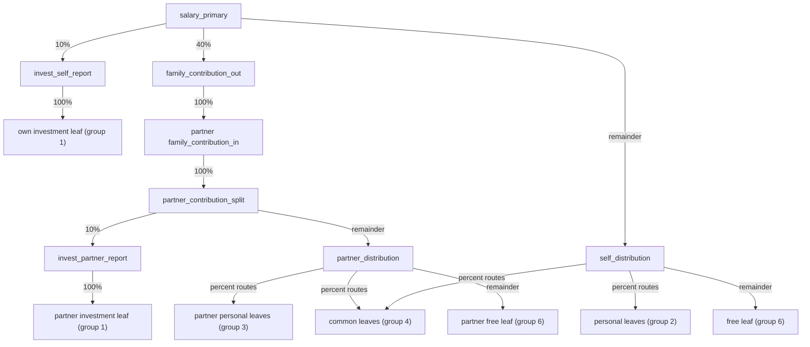

# finance_telegram_bot

Telegram-бот для учета личных финансов с PostgreSQL и расписанием задач. 

## Структура проекта
```
.
├── app.py
├── app/
│   ├── config.py
│   ├── logging_config.py
│   ├── db/
│   │   └── connection.py
│   ├── filters/
│   │   └── category_name.py
│   ├── routers/
│   │   ├── adjustment.py
│   │   ├── balance.py
│   │   ├── commands.py
│   │   ├── earnings.py
│   │   ├── exchange.py
│   │   ├── history.py
│   │   └── spend.py
│   ├── scheduler/
│   │   └── jobs.py
│   ├── services/
│   │   ├── rates.py
│   │   ├── state.py
│   │   └── transactions.py
│   ├── states/
│   │   └── finance.py
│   └── utils/
│       └── keyboards.py
├── download_rates.py
├── download_cripto_rates.py
├── docker-compose.yml
├── scripts/
│   └── apply_db_schema.sh
├── requirements.txt
├── sql_functions.sql
└── tables.sql
```

## Запуск

### Локально
1) Создай `.env` рядом с `app.py` (пример переменных ниже).
2) Установи зависимости:
```
pip install -r requirements.txt
```
3) Запусти:
```
python -m app
```

### Быстрый запуск тестов
```bash
make test
```

Полный прогон (Python + SQL-проверки):
```bash
make test-all
```

Проверка стиля/качества:
```bash
make lint
```

Авто-исправление форматирования:
```bash
make fmt
```

Для SQL-проверок можно переопределить подключение:
```bash
PGPASSWORD=postgres PGHOST=localhost PGPORT=5432 PGUSER=postgres PGDATABASE=finance_test make test-sql
```

### Через Docker
```
docker-compose up --build
```

## Деплой БД (универсально)
- При каждом деплое применяются:
  - `tables.sql` (создание таблиц/индексов, если их нет),
  - `sql_functions.sql` (обновление функций).
- Для этого используется скрипт `scripts/apply_db_schema.sh`.

Ручной запуск:
```
bash scripts/apply_db_schema.sh <postgres_container> <db_user> <db_name> <project_dir>
```

Пример:
```
bash scripts/apply_db_schema.sh finance_telegram_bot_postgres_1 my_finance_bot my_finance_bot /home/kras/finance_telegram_bot
```

## Pre-deploy проверки
- В CI перед деплоем запускаются Python unit-тесты:
  - `tests/test_parsers.py`
  - `tests/test_formatting.py`
  - `tests/test_monthly_logic.py`
  - `tests/test_exchange_error_mapping.py`
- И SQL-контрактные проверки:
  - `tests/sql/predeploy_business_checks.sql`
  - `tests/sql/currency_code_length_checks.sql`
  - `tests/sql/technical_cashflow_description_checks.sql`
  - `tests/sql/exchange_negative_checks.sql`
  - `tests/sql/exchange_edge_case_checks.sql`
  - `tests/sql/spend_with_exchange_checks.sql`
  - `tests/sql/spend_with_exchange_negative_checks.sql`
  - `tests/sql/balance_functions_checks.sql`
  - `tests/sql/monthly_business_checks.sql`
  - `tests/sql/monthly_distribute_golden.sql`

## Переменные окружения
Файл: `.env` (располагается рядом с `app.py`). Пример: `.env.example`.
```
TOKEN=                # Токен Telegram-бота
POSTGRES_USER=        # Пользователь БД
POSTGRES_PASSWORD=    # Пароль пользователя БД
PG_HOST=              # Хост PostgreSQL
PG_PORT=              # Порт PostgreSQL
PG_DATABASE=          # Название базы данных (docker-compose использует его для POSTGRES_DB)
AUTO_APPLY_DB_SCHEMA= # true/false: автоматически применять tables.sql и sql_functions.sql при старте бота
DB_BOOTSTRAP_MAX_ATTEMPTS=   # Количество попыток подключения к БД при старте (по умолчанию 20)
DB_BOOTSTRAP_RETRY_DELAY_SEC=# Пауза между попытками в секундах (по умолчанию 2)
```

## Памятка (test/prod)
- `PG_HOST` внутри контейнеров всегда должен быть `postgres` (имя сервиса в `docker-compose.yml`).
- `PG_PORT` в `.env` влияет только на внешний порт (хост), внутри контейнера используется `5432`.
- Разделение test/prod делается через **разные .env** и **разные volumes**, а не только порт.
- Если поменяли `PG_DATABASE`, нужно пересоздать volume или создать базу вручную.
- В тестовом деплое очистка и восстановление выполняются только при `TEST_RESTORE=1` в `.env`.

## Конфиги (единый список)
- `app/config.py` — переменные окружения и группы категорий.
- `app/logging_config.py` — настройки логирования.
- `docker-compose.yml` — сервисы и параметры контейнеров.
- `requirements.txt` — зависимости Python.
- `tables.sql` — схема БД (создание таблиц).
- `sql_functions.sql` — хранимые функции/процедуры для бота.
- `scripts/seed_monthly_allocation_graph.sql` — idempotent seed для `allocation_nodes` / `allocation_routes` под monthly cascade.
- `TODO_monthly_cascade.md` — план поэтапной миграции месячной логики на `allocation_nodes` / `allocation_routes`.

При деплое через `scripts/apply_db_schema.sh` после `tables.sql` и `sql_functions.sql` автоматически накатывается monthly allocation seed, если файл существует.

Константы расписания: `DAILY_REPORT_HOUR`, `DAILY_REPORT_MINUTE`, `MONTHLY_REPORT_CRON` (см. `app/config.py`).
Сейчас `MONTHLY_REPORT_CRON` используется для ежедневного запуска monthly summary job.

Пример: чтобы перенести ежедневный отчёт на 20:00, установи `DAILY_REPORT_HOUR = 20` и `DAILY_REPORT_MINUTE = 0` в `app/config.py`.

## DB-модули
- `app/db/connection.py` — базовое подключение и выполнение функций.
- `app/db/transactions.py` — операции с транзакциями и дневной/месячной сводкой.
- `app/db/balances.py` — остатки и балансы по группам/категориям.
- `app/db/currency.py` — курсы/обмен валют.
- `app/db/categories.py` — справочник категорий.
- `app/db/users.py` — пользователи бота.

## Потоки
```
Telegram update
  → app/routers/*
    → app/services/* (логика/валидация/планировщик)
      → app/db/* (доменные функции)
        → PostgreSQL (sql_functions.sql)
```

Примеры:
- `/balance` → `app/routers/balance.py` → `app/db/balances.py`
- `/history` → `app/routers/history.py` → `app/services/transactions.py` → `app/db/transactions.py`
- Расход (сумма) → `app/routers/spend.py` → `app/parsers/input.py` → `app/db/transactions.py`

Scheduler:
- Ежедневный отчёт → `app/scheduler/jobs.py` → `app/db/transactions.py`
- Месячный отчёт → `app/scheduler/jobs.py` → `app/db/transactions.py`

Расписание задач (см. `app/scheduler/jobs.py`):
- Ежедневный отчёт: каждый день в 23:59.
- Месячный отчёт: каждый месяц (cron: `month='*'`).

## Курсы валют (без API)
- Все курсы хранятся в `exchange_rates` как количество валюты за 1 USD (USD = 1).
- При обмене с **USD** всегда обновляется другая валюта (USD не меняется).
- Стейблы (USDT/USDC/DAI/…) **обновляются только при обмене с USD**.
- Другие валюты обновляются при обмене с USD или со стейблами.
- Если обмен без USD/стейблов — курс **получаемой** валюты считается по курсу **отдаваемой**.
- Если для пары нет курсов, обмен запрещён — сначала обменяй через USD.

### Примеры
- **RUB → USDT**: обновляется курс **RUB** (USDT не меняется).  
- **USD → USDT**: обновляется курс **USDT**.  
- **USDT → USD**: обновляется курс **USDT**.  
- **USDT → ETH**: обновляется курс **ETH**, курс USDT не меняется.  
- **RUB → ETH**: курс ETH обновляется на основе курса RUB.  
- **ETH → RUB**: курс RUB обновляется на основе курса ETH.  

Источник расписания: `app/config.py`

## Группы категорий
- `GROUP_SPEND = 8` — категории расходов.
- `GROUP_EARNINGS = 10` — категории доходов.
- `GROUP_ALL = 14` — все категории (общий набор для операций).
- `GROUP_COMMON = 4` — общие/семейные категории.
- `GROUP_PERSONAL = 15` — личные категории.
  
Источник: `app/config.py`

## Monthly Migration
- Для поэтапного перевода месячной логики используется `public.monthly_distribute_cascade(...)`.
- Legacy `public.monthly_distribute(...)` сохранена в базе как reference/rollback функция и больше не используется из `public.monthly()`.
- `public.monthly_distribute_cascade(...)` должна оставаться эквивалентной ей по JSON-результату.
- Каскадные ветки и подготовительные шаги переводятся по одной, с compare SQL после каждого изменения.
- Подготовительные шаги `11 -> 13`, `12 -> 7` и reserve уже встроены прямо в `public.monthly_distribute_cascade(...)`; monthly-path больше не зависит от переходных helper-вызовов.
- `monthly_allocation_report_metrics(...)` уже определяет shared leaves и investment leaves через `allocation_nodes` / `allocation_routes`, а не через legacy `group 4` / `group 1`.
- free-category для шага `free_to_gifts` теперь тоже берётся из allocation-графа через remainder leaf `self_distribution`, а не через legacy `get_categories_id(group 6)`.
- Доля перевода `free_to_gifts` теперь хранится в route `free_to_gifts -> gift leaf`, а не считается в orchestrator через legacy `group 7` проценты.
- Добавлены helper-функции чтения из нового ledger:
  - `get_allocation_node_balance(...)`
  - `get_allocation_node_balance_by_slug(...)`
- Runtime пока не переключён на них: manual transactions ещё живут только в `cash_flow`.
- Финальные критерии замены legacy monthly-функции зафиксированы в `TODO_monthly_cascade.md`, секция `Finalization Checklist`.

### Monthly Allocation Graph

Текущий граф monthly-распределения описан в `scripts/seed_monthly_allocation_graph.sql` и используется функцией `public.monthly_distribute_cascade(...)`.

#### Подготовительные шаги до основного monthly split

1. `group 11` доходы консолидируются через root `monthly_income_sources` в legacy income bucket пользователя (`group 13`).
2. `group 12` дополнительные доходы консолидируются через root `extra_income_sources` в legacy extra bucket пользователя (`group 7`).
3. Отрицательные personal-spend категории резервируются через root `debt_reserve` в reserve bucket пользователя (`group 9`) по правилу `1%` от отрицательного баланса.
   Для тестовой пары источники reserve зафиксированы канонически:
   `249716305 -> cat_2, cat_8, cat_9, cat_11`;
   `943915310 -> cat_17, cat_18, cat_20, cat_21, cat_26`.
4. Из free-category (`group 6`) через root `free_to_gifts` переводится только legacy `group 7` доля free-баланса.
   Для суммы перевода сохраняется старая формула `free_balance * sum(percent(group 7))`, а route уже ведёт эту сумму в canonical gifts leaf пользователя.
5. После этого основной monthly каскад стартует из `salary_primary` на балансе `_income_category`.

#### Узлы графа

- Технические roots на пользователя:
  - `monthly_income_sources`
  - `extra_income_sources`
  - `free_to_gifts`
  - `debt_reserve`
  - `salary_primary`
  - `family_contribution_in`
  - `partner_contribution_split`
  - `self_distribution`
  - `partner_distribution`
- Report-узлы на пользователя:
  - `invest_self_report`
  - `family_contribution_out`
  - `invest_partner_report`
- Leaf-ноды на пользователя:
  - `cat_<id>` для категорий из legacy groups `1`, `2`, `3`, `6`, `7`, `9`, `13`, если это не общая категория.
- Shared leaf-ноды на пару:
  - `cat_<id>` для категорий из `group 4`.
  - Эти узлы принадлежат `user_group` `monthly_pair_249716305_943915310`.

#### Основной monthly split



#### Как маршрутизируются leaves

- `salary_primary -> invest_self_report`
  - `10%`, потом `invest_self_report -> group 1`.
- `salary_primary -> family_contribution_out`
  - `40%`, потом межпользовательский мост в `family_contribution_in` партнёра.
- `salary_primary -> self_distribution`
  - remainder после `10%` и `40%`.
- `family_contribution_in -> partner_contribution_split`
  - `100%`.
- `partner_contribution_split -> invest_partner_report`
  - `10%` от полученного семейного взноса.
- `partner_contribution_split -> partner_distribution`
  - remainder.
- `self_distribution`
  - категории из `group 2` с `0 < percent < 1`;
  - если категория является общей, маршрут идёт в shared leaf пары (`group 4`);
  - если категория личная, маршрут идёт в user-owned leaf;
  - один remainder route уходит в free leaf пользователя (`group 6`).
- `partner_distribution`
  - категории из `group 3` с `0 < percent < 1`;
  - общие категории также идут в shared leaves пары;
  - личные категории партнёра идут в его user-owned leaves;
  - один remainder route уходит в free leaf получателя (`group 6`).

#### Семантика отчёта

- `investition`
  - сумма по `invest_self_report`.
- `семейный_взнос`
  - сумма по `family_contribution_out`.
- `investition_second`
  - сумма по `invest_partner_report`, то есть `10%` от полученного семейного взноса у получателя.
- `общие_категории`
  - сумма по shared group-owned leaves пары.

#### Ограничения текущей реализации

- `monthly()` теперь всегда использует `monthly_distribute_cascade()`, поэтому перед запуском в БД должны существовать roots:
  - `monthly_income_sources`
  - `extra_income_sources`
  - `free_to_gifts`
  - `debt_reserve`
  - `salary_primary`
- Пока тестируем миграцию на restored legacy data, seed для single-target roots (`monthly_income_sources`, `extra_income_sources`, `debt_reserve`, `invest_*_report`) использует явные канонические leaf-категории для пользователей `249716305` и `943915310`.
  Это защищает граф от грязных legacy group mappings вроде попадания `cat_15` в investment group.
- Источники reserve для этой пары тоже зафиксированы канонически в `monthly_distribute_cascade()`:
  `249716305 -> cat_2, cat_8, cat_9, cat_11`;
  `943915310 -> cat_17, cat_18, cat_20, cat_21, cat_26`.

### Allocation Ledger

- В схему добавлена таблица `public.allocation_postings` как будущий graph-native ledger.
- Минимальная форма таблицы:
  - `datetime`
  - `user_id`
  - `from_node_id`
  - `to_node_id`
  - `value`
  - `currency`
  - `description`
  - `metadata`
- Leaf-проводки нового allocation-движка уже пишутся в `allocation_postings` параллельно с `cash_flow`.
- `cash_flow` остаётся compatibility ledger; `allocation_postings` пока используется как новый graph-native mirror.
- `monthly_distribute_cascade()` уже читает `month_earnings` и `month_spend` из `allocation_postings`, а не из `cash_flow`.
- Для безопасного наблюдения за новым ledger добавлен read-only helper:
  - `public.get_last_allocation_postings(user_id, num)`
  - `public.get_last_transaction_v2(user_id, num)` как ledger-backed candidate для `/history`
  - `public.get_daily_allocation_transactions(user_id)`
  - `public.get_category_balance_v2(user_id, category_id, currency)`
  - `public.get_group_balance_v2(user_id, group_id)`
  - `public.get_remains_v2(user_id, category_name)`
  - `public.get_all_balances_v2(user_id, group_id)`
  - `public.get_category_balance_with_currency_v2(user_id, category_id)`
  - `/history` читает ledger-backed `get_last_transaction_v2()`
  - delete-flow в `/history` удаляет `allocation_postings` и linked legacy `cash_flow`, если он есть в metadata
- daily scheduler уже использует ledger-backed `get_daily_transactions()`
- `/balance` и spend balance checks уже используют ledger-backed v2 balance helpers.
- При развёртывании выполняется idempotent backfill `cash_flow -> allocation_postings` через [scripts/backfill_cash_flow_to_allocation_postings.sql](/Users/kras/Documents/My Python progects/finance_telegram_bot/scripts/backfill_cash_flow_to_allocation_postings.sql).
- Новые dual-write записи помечаются в `metadata.legacy_cash_flow_id`, чтобы backfill не создавал дубли.
- Текущая конвенция `metadata`:
  - monthly runtime: `kind=monthly`, `subkind=leaf_posting`, `origin=allocation_runtime`
  - backfill: `kind=backfill`, `subkind=cash_flow`, `origin=migration`
  - будущий exchange:
    - ручной: `kind=exchange`, `subkind=manual`, `origin=app`
    - авто: `kind=exchange`, `subkind=auto`, `origin=system`

## Заметки
- Основная точка входа: `app.py`.
- Роутеры лежат в `app/routers/`.
- Подключение к БД: `app/db/connection.py`.
- Планировщик задач: `app/scheduler/jobs.py`.

## Команды и сценарии

### Команды
- `/start` — приветствие.
- `/home` — сброс состояния и возврат к основному меню.
- `/balance` — выбор вида баланса (личные/общие/все/по категориям).
- `/history` — история транзакций с возможностью навигации и удаления.
- `/exchange` — обмен валют внутри категории.
- `/adjustment` — ручная корректировка (+/-).

### Быстрые сценарии ввода
- **Расход**: `СУММА [ВАЛЮТА] [КОММЕНТАРИЙ]`, затем выбор категории расхода.  
  Пример: `1200 rub продукты`
- **Доход**: кнопка `Доход`, выбор категории дохода, затем ввод суммы.  
  Пример: `50000` (валюта по умолчанию RUB)
- **Остаток**: кнопка `Остаток` — вывод всех категорий и балансов.
