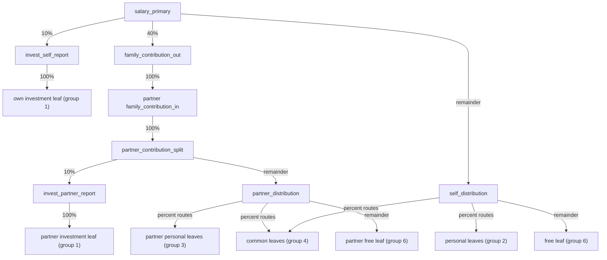

# finance_telegram_bot

Telegram-бот для учета личных финансов с PostgreSQL и расписанием задач. 

## Product Docs

- [docs/PROJECT_VISION.md](/Users/kras/Documents/My%20Python%20progects/finance_telegram_bot/docs/PROJECT_VISION.md) - зачем нужен проект, к чему он должен прийти и какие инварианты важнее всего.
- [docs/PRODUCT_REQUIREMENTS.md](/Users/kras/Documents/My%20Python%20progects/finance_telegram_bot/docs/PRODUCT_REQUIREMENTS.md) - черновик продуктовых требований и направлений развития.
- [docs/DELIVERY_AND_MIGRATION.md](/Users/kras/Documents/My%20Python%20progects/finance_telegram_bot/docs/DELIVERY_AND_MIGRATION.md) - общий release/migration policy для изменений в финансовом ядре.
- [docs/OPEN_QUESTIONS.md](/Users/kras/Documents/My%20Python%20progects/finance_telegram_bot/docs/OPEN_QUESTIONS.md) - список вопросов, которые нужно дозаполнить перед детализацией roadmap и UI.
- [TODO_monthly_cascade.md](/Users/kras/Documents/My%20Python%20progects/finance_telegram_bot/TODO_monthly_cascade.md) - рабочий план по критичному monthly/migration-контуру.
- [PROD_MONTHLY_MIGRATION.md](/Users/kras/Documents/My%20Python%20progects/finance_telegram_bot/PROD_MONTHLY_MIGRATION.md) - операционный план безопасного продового переезда monthly/ledger runtime.

## Структура проекта
```
.
├── docs/
│   ├── DELIVERY_AND_MIGRATION.md
│   ├── OPEN_QUESTIONS.md
│   ├── PRODUCT_REQUIREMENTS.md
│   └── PROJECT_VISION.md
├── app.py
├── app/
│   ├── config.py
│   ├── logging_config.py
│   ├── db/
│   │   └── connection.py
│   ├── filters/
│   │   └── category_name.py
│   ├── routers/
│   │   ├── adjustment.py
│   │   ├── balance.py
│   │   ├── commands.py
│   │   ├── earnings.py
│   │   ├── exchange.py
│   │   ├── history.py
│   │   └── spend.py
│   ├── scheduler/
│   │   └── jobs.py
│   ├── services/
│   │   ├── rates.py
│   │   ├── state.py
│   │   └── transactions.py
│   ├── states/
│   │   └── finance.py
│   └── utils/
│       └── keyboards.py
├── download_rates.py
├── download_cripto_rates.py
├── docker-compose.yml
├── scripts/
│   └── apply_db_schema.sh
├── requirements.txt
├── sql_functions.sql
└── tables.sql
```

## Запуск

### Локально
1) Создай `.env` рядом с `app.py` (пример переменных ниже).
2) Установи зависимости:
```
pip install -r requirements.txt
```
3) Запусти:
```
python -m app
```

### Быстрый запуск тестов
```bash
make test
```

Полный прогон (Python + SQL-проверки):
```bash
make test-all
```

Проверка стиля/качества:
```bash
make lint
```

Авто-исправление форматирования:
```bash
make fmt
```

Для SQL-проверок можно переопределить подключение:
```bash
PGPASSWORD=postgres PGHOST=localhost PGPORT=5432 PGUSER=postgres PGDATABASE=finance_test make test-sql
```

Полный прогон для тестового сервера:
```bash
PGPASSWORD=postgres PGHOST=localhost PGPORT=5432 PGUSER=postgres PGDATABASE=finance_test make test-server-validate
```

Если нужен ещё и реальный smoke вызов `monthly()` после schema/seed/bootstrap:
```bash
PGPASSWORD=postgres PGHOST=localhost PGPORT=5432 PGUSER=postgres PGDATABASE=finance_test RUN_MONTHLY_SMOKE=1 make test-server-validate
```

### Через Docker
```
docker-compose up --build
```

## Деплой БД (универсально)
- При каждом деплое применяются:
  - `tables.sql` (создание таблиц/индексов, если их нет),
  - `sql_functions.sql` (обновление функций).
- Для этого используется скрипт `scripts/apply_db_schema.sh`.

Ручной запуск:
```
bash scripts/apply_db_schema.sh <postgres_container> <db_user> <db_name> <project_dir>
```

Пример:
```
bash scripts/apply_db_schema.sh finance_telegram_bot_postgres_1 my_finance_bot my_finance_bot /home/kras/finance_telegram_bot
```

## Pre-deploy проверки
- В CI перед деплоем запускаются Python unit-тесты:
  - `tests/test_parsers.py`
  - `tests/test_formatting.py`
  - `tests/test_monthly_logic.py`
  - `tests/test_exchange_error_mapping.py`
- И SQL-контрактные проверки:
  - `tests/sql/predeploy_business_checks.sql`
  - `tests/sql/currency_code_length_checks.sql`
  - `tests/sql/technical_cashflow_description_checks.sql`
  - `tests/sql/user_membership_helper_checks.sql`
  - `tests/sql/exchange_negative_checks.sql`
  - `tests/sql/exchange_edge_case_checks.sql`
  - `tests/sql/spend_with_exchange_checks.sql`
  - `tests/sql/spend_with_exchange_negative_checks.sql`
  - `tests/sql/allocation_legacy_bootstrap_checks.sql`
  - `tests/sql/ledger_write_path_checks.sql`
  - `tests/sql/balance_functions_checks.sql`
  - `tests/sql/monthly_business_checks.sql`
  - `tests/sql/monthly_distribute_allocation_checks.sql`
  - `tests/sql/monthly_distribute_cascade_checks.sql`

## Переменные окружения
Файл: `.env` (располагается рядом с `app.py`). Пример: `.env.example`.
```
TOKEN=                # Токен Telegram-бота
POSTGRES_USER=        # Пользователь БД
POSTGRES_PASSWORD=    # Пароль пользователя БД
PG_HOST=              # Хост PostgreSQL
PG_PORT=              # Порт PostgreSQL
PG_DATABASE=          # Название базы данных (docker-compose использует его для POSTGRES_DB)
AUTO_APPLY_DB_SCHEMA= # true/false: автоматически применять tables.sql и sql_functions.sql при старте бота
DB_BOOTSTRAP_MAX_ATTEMPTS=   # Количество попыток подключения к БД при старте (по умолчанию 20)
DB_BOOTSTRAP_RETRY_DELAY_SEC=# Пауза между попытками в секундах (по умолчанию 2)
```

## Памятка (test/prod)
- `PG_HOST` внутри контейнеров всегда должен быть `postgres` (имя сервиса в `docker-compose.yml`).
- `PG_PORT` в `.env` влияет только на внешний порт (хост), внутри контейнера используется `5432`.
- Разделение test/prod делается через **разные .env** и **разные volumes**, а не только порт.
- Если поменяли `PG_DATABASE`, нужно пересоздать volume или создать базу вручную.
- В тестовом деплое очистка и восстановление выполняются только при `TEST_RESTORE=1` в `.env`.

## Конфиги (единый список)
- `app/config.py` — переменные окружения и группы категорий.
- `app/logging_config.py` — настройки логирования.
- `docker-compose.yml` — сервисы и параметры контейнеров.
- `requirements.txt` — зависимости Python.
- `tables.sql` — схема БД (создание таблиц).
- `sql_functions.sql` — хранимые функции/процедуры для бота.
- `scripts/seed_monthly_allocation_graph.sql` — idempotent seed для `allocation_nodes` / `allocation_routes` под monthly cascade.
- [PROD_MONTHLY_MIGRATION.md](/Users/kras/Documents/My%20Python%20progects/finance_telegram_bot/PROD_MONTHLY_MIGRATION.md) — операционный план продового переезда на ledger/scenario-driven monthly runtime.
- `TODO_monthly_cascade.md` — план поэтапной миграции месячной логики на `allocation_nodes` / `allocation_routes`.

При деплое через `scripts/apply_db_schema.sh` после `tables.sql` и `sql_functions.sql` автоматически накатывается monthly allocation seed, если файл существует.

Константы расписания: `DAILY_REPORT_HOUR`, `DAILY_REPORT_MINUTE`, `MONTHLY_REPORT_CRON` (см. `app/config.py`).
В ветке `test` `MONTHLY_REPORT_CRON` сейчас используется для ежедневного запуска monthly summary job в `00:00 UTC`.

Пример: чтобы перенести ежедневный отчёт на 20:00, установи `DAILY_REPORT_HOUR = 20` и `DAILY_REPORT_MINUTE = 0` в `app/config.py`.

## DB-модули
- `app/db/connection.py` — базовое подключение и выполнение функций.
- `app/db/transactions.py` — операции с транзакциями и дневной/месячной сводкой.
- `app/db/balances.py` — остатки и балансы по группам/категориям.
- `app/db/currency.py` — курсы/обмен валют.
- `app/db/categories.py` — справочник категорий.
- `app/db/users.py` — пользователи бота.

## Потоки
```
Telegram update
  → app/routers/*
    → app/services/* (логика/валидация/планировщик)
      → app/db/* (доменные функции)
        → PostgreSQL (sql_functions.sql)
```

Примеры:
- `/balance` → `app/routers/balance.py` → `app/db/balances.py`
- `/history` → `app/routers/history.py` → `app/services/transactions.py` → `app/db/transactions.py`
- Расход (сумма) → `app/routers/spend.py` → `app/parsers/input.py` → `app/db/transactions.py`

Scheduler:
- Ежедневный отчёт → `app/scheduler/jobs.py` → `app/db/transactions.py`
- Месячный отчёт → `app/scheduler/jobs.py` → `app/db/transactions.py`

Расписание задач (см. `app/scheduler/jobs.py`):
- Ежедневный отчёт: каждый день в 23:59.
- Месячный отчёт: `1` числа каждого месяца в `00:00 UTC`.

## Курсы валют (без API)
- Все курсы хранятся в `exchange_rates` как количество валюты за 1 USD (USD = 1).
- При обмене с **USD** всегда обновляется другая валюта (USD не меняется).
- Стейблы (USDT/USDC/DAI/…) **обновляются только при обмене с USD**.
- Другие валюты обновляются при обмене с USD или со стейблами.
- Если обмен без USD/стейблов — курс **получаемой** валюты считается по курсу **отдаваемой**.
- Если для пары нет курсов, обмен запрещён — сначала обменяй через USD.

### Примеры
- **RUB → USDT**: обновляется курс **RUB** (USDT не меняется).  
- **USD → USDT**: обновляется курс **USDT**.  
- **USDT → USD**: обновляется курс **USDT**.  
- **USDT → ETH**: обновляется курс **ETH**, курс USDT не меняется.  
- **RUB → ETH**: курс ETH обновляется на основе курса RUB.  
- **ETH → RUB**: курс RUB обновляется на основе курса ETH.  

Источник расписания: `app/config.py`

## Группы категорий
- `GROUP_SPEND = 8` — категории расходов.
- `GROUP_EARNINGS = 10` — категории доходов.
- `GROUP_ALL = 14` — все категории (общий набор для операций).
- `GROUP_COMMON = 4` — общие/семейные категории.
- `GROUP_PERSONAL = 15` — личные категории.
  
Источник: `app/config.py`

## Monthly Migration
- Для поэтапного перевода месячной логики используется `public.monthly_distribute_cascade(...)`.
- Legacy `public.monthly_distribute(...)` сохранена в базе как reference/rollback функция и больше не используется из `public.monthly()`.
- `public.monthly_distribute_cascade(...)` сохраняет форму Telegram JSON, но использует clean monthly semantics: investment и family contribution отделяются явно, дальше распределяется clean remainder.
- Каскадные ветки и подготовительные шаги переводятся по одной, с SQL checks после каждого изменения.
- Подготовительные шаги `11 -> 13`, `12 -> 7` и reserve уже встроены прямо в `public.monthly_distribute_cascade(...)`; monthly-path больше не зависит от переходных helper-вызовов.
- `monthly_allocation_report_metrics(...)` уже определяет shared leaves и investment leaves через `allocation_nodes` / `allocation_routes`, а не через legacy `group 4` / `group 1`.
- free-balance для шага `free_to_gifts` теперь считается по allocation remainder leaf node из `self_distribution`, а не через legacy category balance.
- Доля перевода `free_to_gifts` теперь хранится в route `free_to_gifts -> gift leaf`, а не считается в orchestrator через legacy `group 7` проценты.
- Добавлены helper-функции чтения из нового ledger:
  - `get_allocation_node_balance(...)`
  - `get_allocation_node_balance_by_slug(...)`
- App runtime manual transactions уже читают и пишут через `allocation_postings`.
- Финальные критерии замены legacy monthly-функции зафиксированы в `TODO_monthly_cascade.md`, секция `Finalization Checklist`.

### Monthly Allocation Graph

Текущий граф monthly-распределения описан в `scripts/seed_monthly_allocation_graph.sql` и используется функцией `public.monthly_distribute_cascade(...)`.

#### Подготовительные шаги до основного monthly split

1. `group 11` доходы консолидируются через root `monthly_income_sources` в legacy income bucket пользователя (`group 13`).
2. `group 12` дополнительные доходы консолидируются через root `extra_income_sources` в legacy extra bucket пользователя (`group 7`).
3. Отрицательные personal-spend категории резервируются через root `debt_reserve` в reserve bucket пользователя (`group 9`) по правилу `1%` от отрицательного баланса.
   Source category должна быть одновременно в legacy spend `group 8` и personal `group 15`.
4. Из free-category (`group 6`) через root `free_to_gifts` переводится только legacy `group 7` доля free-баланса.
   Для суммы перевода сохраняется старая формула `free_balance * sum(percent(group 7))`, а route уже ведёт эту сумму в canonical gifts leaf пользователя.
5. После этого основной monthly каскад стартует из `salary_primary` на балансе income leaf, связанной через обязательный scenario binding `branch_source`.
   Для ledger-проводок cascade передаёт в `allocation_distribute(...)` явный source allocation node, поэтому debit-side уже не выбирается внутри движка только по `legacy_category_id`.

#### Узлы графа

- Технические roots на пользователя:
  - `monthly_income_sources`
  - `extra_income_sources`
  - `free_to_gifts`
  - `debt_reserve`
  - `salary_primary`
  - `family_contribution_in`
  - `partner_contribution_split`
  - `self_distribution`
  - `partner_distribution`
- Report-узлы на пользователя:
  - `invest_self_report`
  - `family_contribution_out`
  - `invest_partner_report`
- Leaf-ноды на пользователя:
  - `cat_<id>` для категорий из legacy groups `1`, `2`, `3`, `6`, `7`, `9`, `13`, если это не общая категория.
- Shared leaf-ноды на пару:
  - `cat_<id>` для категорий из `group 4`.
  - Эти узлы принадлежат `user_group` `monthly_pair_249716305_943915310`.

#### Основной monthly split



#### Как маршрутизируются leaves

- `salary_primary -> invest_self_report`
  - `10%`, потом `invest_self_report -> group 1`.
- `salary_primary -> family_contribution_out`
  - `40%`, потом межпользовательский мост в `family_contribution_in` партнёра.
- `salary_primary -> self_distribution`
  - remainder после `10%` и `40%`.
- `family_contribution_in -> partner_contribution_split`
  - `100%`.
- `partner_contribution_split -> invest_partner_report`
  - `10%` от полученного семейного взноса.
- `partner_contribution_split -> partner_distribution`
  - remainder.
- `self_distribution`
  - категории из `group 2` с `0 < percent < 1`;
  - route percent равен legacy percent: после явных `10%` investment и `40%` family split распределяется только clean remainder;
  - если категория является общей, маршрут идёт в shared leaf пары (`group 4`);
  - если категория личная, маршрут идёт в user-owned leaf;
  - один remainder route уходит в free leaf пользователя (`group 6`).
- `partner_distribution`
  - категории из `group 3` с `0 < percent < 1`;
  - общие категории также идут в shared leaves пары;
  - личные категории партнёра идут в его user-owned leaves;
  - один remainder route уходит в free leaf получателя (`group 6`).

#### Семантика отчёта

- `investition`
  - сумма по `invest_self_report`.
- `семейный_взнос`
  - сумма по `family_contribution_out`.
- `investition_second`
  - сумма по `invest_partner_report`, то есть `10%` от полученного семейного взноса у получателя.
- `общие_категории`
  - сумма по shared group-owned leaves пары.
  - shared report rows теперь несут `owner_user_id` текущей ветки, поэтому доля каждого пользователя считается напрямую по report rows, без остаточной формулы.

#### Ограничения текущей реализации

- `monthly()` теперь всегда использует `monthly_distribute_cascade()`, поэтому перед запуском в БД должны существовать roots:
  - `monthly_income_sources`
  - `extra_income_sources`
  - `free_to_gifts`
  - `debt_reserve`
  - `salary_primary`
- Пока тестируем миграцию на restored legacy data, seed заводит monthly scenario bindings для `salary_primary`, single-target roots и `family_contribution_out`,
  а также monthly scenario root params для prep/reserve веток.
  Это защищает граф от грязных legacy group mappings вроде попадания `cat_15` в investment group и постепенно убирает business-config из тела SQL-функций.
  Pair-specific seed config теперь централизован в верхнем `tmp_monthly_seed_*` блоке, а route exclusions для investment leaves выводятся из seeded `root_target`, а не из разбросанных literal category id.
  Источник этих `tmp_monthly_seed_*` таблиц теперь постоянный: `allocation_seed_profiles*`.
- Источники reserve определяются динамически как пересечение legacy spend `group 8` и personal `group 15`.

### Allocation Ledger

- В схему добавлена таблица `public.allocation_postings` как будущий graph-native ledger.
- В схему добавлены `public.allocation_scenarios`, `public.allocation_scenario_node_bindings` и `public.allocation_scenario_root_params` как общий runtime config-слой для allocation-сценариев.
  Сценарий может принадлежать либо одному `user`, либо `user_group`, поэтому схема подходит и для personal monthly, и для household monthly.
- Отдельно добавлены `public.allocation_seed_profiles`, `public.allocation_seed_profile_users`,
  `public.allocation_seed_profile_bindings`, `public.allocation_seed_profile_root_params` как bootstrap config-слой для seed-скриптов.
- Минимальная форма таблицы:
  - `datetime`
  - `user_id`
  - `from_node_id`
  - `to_node_id`
  - `value`
  - `currency`
  - `description`
  - `metadata`
- Leaf-проводки нового allocation-движка пишутся только в `allocation_postings`; legacy `cash_flow` остаётся historical/backfill source.
- Простые manual spend/revenue write-paths уже ledger-only и больше не создают новые `cash_flow` rows.
- Monthly allocation helpers уже читают source balance, `month_earnings` и `month_spend` из `allocation_postings`, а не из `cash_flow`.
- `monthly_distribute_cascade()` уже читает source balances через graph-native `get_allocation_node_balance(...)` по source node id.
- `monthly_distribute_cascade()` уже берёт source category membership из `allocation_node_groups`, а не напрямую из `categories_category_groups`.
- `free_to_gifts` уже берёт free balance через `get_allocation_node_balance(...)` по remainder node id.
- `monthly_distribute_cascade()` уже передаёт source category node id в `allocation_distribute(...)` для prep-веток, reserve, `free_to_gifts` и основного `salary_primary` split.
  `legacy_category_id` пока остаётся compatibility-полем для балансов, metadata и bridge/backfill, но больше не является единственным способом выбрать debit-node внутри monthly runtime.
- Вызовы `allocation_distribute(...)` из `monthly_distribute_cascade()` больше не передают legacy source category id; он выводится из source node только как compatibility metadata.
- Low-level `allocation_distribute(...)` больше не создаёт compatibility bridge-ноду на лету, если source node не найден по legacy category id.
  Runtime должен либо передать явный `source_category_node_id`, либо иметь уже существующую allocation-ноду для этой legacy category.
- `monthly()` больше не содержит hard-coded monthly users и income category id; entrypoint запускает `monthly_distribute_cascade(user_id)` по активным user-owned `salary_primary` roots.
  `salary_primary` требует source leaf через `allocation_scenario_node_bindings` (`binding_kind = branch_source`).
  Prep/reserve roots требуют scenario root params (`source_legacy_group_id`, `spend_legacy_group_id`, `personal_legacy_group_id`) через `allocation_scenario_root_params`, а не из root metadata и не из hard-coded условий в function body.
  `family_contribution_out` требует partner source leaf через `allocation_scenario_node_bindings` (`binding_kind = bridge_source`).
  Legacy-параметр `_income_category` в `monthly_distribute_cascade()` сохранён только ради SQL-совместимости сигнатуры и больше не участвует в source resolution.
- Internal helper `monthly_distribute_allocation(...)` теперь требует явный `source_category_node_id`;
  legacy category id остаётся там только как compatibility metadata/validation against the provided node.
- Partner bridge `family_contribution_out -> family_contribution_in` резолвит source leaf через `allocation_scenario_node_bindings`, без metadata fallback.
- Graph-native leaf-ноды больше не обязаны иметь `legacy_category_id`; он пишется в metadata только если присутствует на source/target node.
- Household membership helper `get_users_id(...)` читает только `user_group_memberships`.
- Для безопасного наблюдения за новым ledger добавлен read-only helper:
  - `public.get_last_allocation_postings(user_id, num)`
  - `public.get_last_transaction_v2(user_id, num)` как ledger-backed candidate для `/history`
  - `public.get_daily_allocation_transactions(user_id)`
  - `public.get_category_balance_v2(user_id, category_id, currency)`
  - `public.get_group_balance_v2(user_id, group_id)`
  - `public.get_remains_v2(user_id, category_name)`
  - `public.get_all_balances_v2(user_id, group_id)`
  - `public.get_category_balance_with_currency_v2(user_id, category_id)`
  - `public.get_currency_v2()`
  - `/history` читает ledger-backed `get_last_transaction_v2()`
  - delete-flow в `/history` удаляет `allocation_postings` и tombstone'ит `legacy_cash_flow_id`, чтобы backfill не воскрешал удалённую историю
- daily scheduler уже использует ledger-backed `get_daily_transactions()`
- `/balance` и spend balance checks уже используют ledger-backed v2 balance helpers.
- Category UI lookup уже использует allocation-backed helpers:
  - `public.get_categories_name_v2(user_id, group_id)`
  - `public.get_category_id_from_name_v2(user_id, category_name)`
- Allocation-primary write candidates are available for manual transactions:
  - `public.insert_spend_v2(...)`
  - `public.insert_revenue_v2(...)`
  - `public.insert_spend_with_exchange_v2(...)`
  - `public.exchange_v2(...)`
  App write-paths for manual spend/revenue, auto-exchange spend, and manual exchange already use these v2 functions.
  Manual spend/revenue, manual exchange, and auto-exchange spend are ledger-only.
  `exchange_v2(...)` тоже больше не создаёт compatibility bridge-ноду на лету: wallet/category allocation node должна существовать заранее.
- Старый app-facing SQL API удалён:
  `get_last_transaction(...)`, `get_categories_name(...)`, `get_group_balance(...)`,
  `get_remains(...)`, `get_all_balances(...)`, `get_category_id_from_name(...)`,
  `get_category_balance_with_currency(...)`, `get_currency()`,
  `insert_spend(...)`, `insert_revenue(...)`, `insert_spend_with_exchange(...)`, `exchange(...)`.
- В SQL пока ещё остаётся отдельный legacy monthly/reference cluster, не используемый app runtime:
  `monthly_distribute(...)`, `distribute_to_group(...)`, `transact_from_group_to_category(...)`,
  `get_category_balance(...)`, `get_categories_id(...)`.
- При развёртывании выполняется idempotent backfill `cash_flow -> allocation_postings` через [scripts/backfill_cash_flow_to_allocation_postings.sql](/Users/kras/Documents/My Python progects/finance_telegram_bot/scripts/backfill_cash_flow_to_allocation_postings.sql).
- Canonical SQL entrypoint для этого шага: `public.bootstrap_allocation_ledger_from_legacy()`.
  Скрипт backfill теперь только вызывает эту функцию, чтобы prod-bootstrap оставался в одном месте и не дублировался между `.sql` файлами.
- Historical/backfill rows may carry `metadata.legacy_cash_flow_id`; new runtime ledger-only writes do not.
- Текущая конвенция `metadata`:
  - monthly runtime: `kind=monthly`, `subkind=leaf_posting`, `origin=allocation_runtime`
  - backfill: `kind=backfill`, `subkind=cash_flow`, `origin=migration`
  - manual exchange runtime: `kind=exchange`, `subkind=manual`, `origin=app`
  - auto exchange runtime: `kind=exchange`, `subkind=auto`, `origin=system`

### Allocation Scenarios

- `allocation_scenarios`
  - владелец сценария: либо `owner_user_id`, либо `owner_user_group_id`
  - `scenario_kind`: бизнес-тип сценария, например `monthly`
  - `schedule_cron`: cron-строка запуска; `NULL` означает ручной сценарий без расписания
    Примеры:
    `0 9 1 * *` - каждый месяц в 09:00 первого числа
    `0 9 1 */2 *` - раз в 2 месяца в 09:00 первого числа
    `0 9 * * 1` - каждую неделю в понедельник в 09:00
  - `slug`
  - `name`
  - `description`
  - `active`
  - `metadata`
- `allocation_scenario_node_bindings`
  - `scenario_id`
  - `root_node_id`: root/ветка, для которой задаётся привязка
  - `binding_kind`: смысл привязки
    `branch_source` - откуда стартовать ветку
    `root_target` - в какой leaf вести single-target root
    `bridge_source` - какой leaf использовать как source для bridge
  - `bound_node_id`: конкретная нода, которая отвечает на вопрос из `binding_kind`
  - `priority`: приоритет выбора, если для одной ветки есть несколько активных кандидатов одного `binding_kind`
  - `active`
  - `metadata`
- `allocation_scenario_root_params`
  - `scenario_id`
  - `root_node_id`: root/ветка, для которой задаётся scalar-конфиг сценария
  - `param_key`: имя параметра, например `source_legacy_group_id`
  - `param_value`: строковое значение параметра; runtime сам приводит его к нужному типу
  - `active`
  - `metadata`
- Этот слой отвечает на 3 сценарных вопроса:
  - откуда стартовать ветку
  - в какой leaf вести single-target root
  - какой leaf использовать как source для bridge
- Monthly runtime уже использует этот слой для `salary_primary.branch_source`, single-target roots, `family_contribution_out.bridge_source`
  и prep/reserve scalar config через `allocation_scenario_root_params`.
- Metadata fallback для `salary_primary`, `family_contribution_out` и prep/reserve roots уже убран.

### Allocation Seed Profiles

- `allocation_seed_profiles`
  - `profile_kind`: тип bootstrap-профиля, сейчас `monthly`
  - `slug`
  - `name`
  - `description`
  - `shared_group_slug`, `shared_group_name`, `shared_group_description`: какой shared `user_group` должен создать seed
  - `active`
  - `metadata`
- `allocation_seed_profile_users`
  - какие пользователи входят в bootstrap-профиль
  - `scenario_slug`, `scenario_name`, `scenario_description`: какой scenario должен быть создан для этого пользователя
- `allocation_seed_profile_bindings`
  - canonical root/binding config для seed-materialization
  - хранит `root_slug`, `binding_kind`, `bound_slug`
- `allocation_seed_profile_root_params`
  - scalar config для seed-materialization
  - хранит `root_slug`, `param_key`, `param_value`
- `scripts/seed_monthly_allocation_graph.sql` сначала синхронизирует default monthly profile в этих таблицах,
  потом поднимает `tmp_monthly_seed_*` уже из БД и materialize'ит runtime graph/scenarios/routes для всех активных monthly profiles.
- Seed intentionally rejects ambiguous config:
  если один `user_id` попал больше чем в один активный monthly seed profile, скрипт падает явно.

## Заметки
- Основная точка входа: `app.py`.
- Роутеры лежат в `app/routers/`.
- Подключение к БД: `app/db/connection.py`.
- Планировщик задач: `app/scheduler/jobs.py`.

## Команды и сценарии

### Команды
- `/start` — приветствие.
- `/home` — сброс состояния и возврат к основному меню.
- `/balance` — выбор вида баланса (личные/общие/все/по категориям).
- `/history` — история транзакций с возможностью навигации и удаления.
- `/exchange` — обмен валют внутри категории.
- `/adjustment` — ручная корректировка (+/-).

### Быстрые сценарии ввода
- **Расход**: `СУММА [ВАЛЮТА] [КОММЕНТАРИЙ]`, затем выбор категории расхода.  
  Пример: `1200 rub продукты`
- **Доход**: кнопка `Доход`, выбор категории дохода, затем ввод суммы.  
  Пример: `50000` (валюта по умолчанию RUB)
- **Остаток**: кнопка `Остаток` — вывод всех категорий и балансов.
